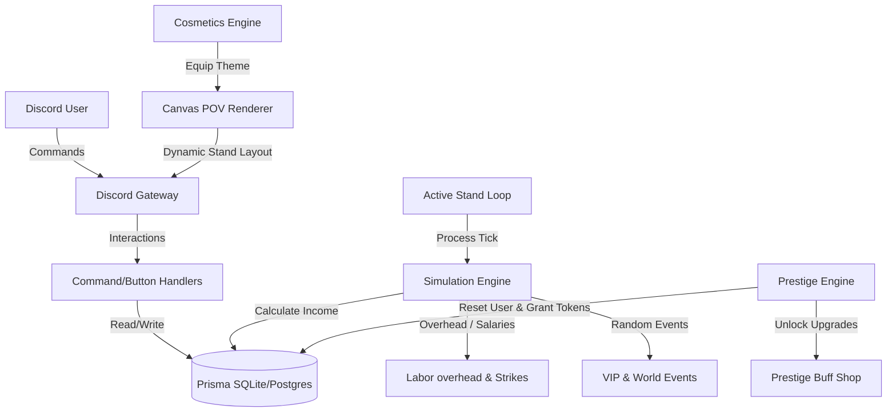

# ScoopShack — Complete Production Roadmap & Architecture Blueprint

This document serves as the definitive engineering roadmap and architectural specification to complete all remaining systems of the ScoopShack Discord Bot.

---

## System Architecture Overview



---

## 1. Database Schema Additions
To support the prestige upgrades, customizable cosmetic themes, and rotating quests, the following additions must be made to `prisma/schema.prisma`.

```prisma
// --- prisma/schema.prisma additions ---

model User {
  // Existing fields...
  prestigeTokens  Int             @default(0)
  equippedTheme   String          @default("default")
  
  // New relations
  prestigeUpgrades PrestigeUpgrade[]
  themes           UserTheme[]
}

model PrestigeUpgrade {
  id        String   @id @default(uuid())
  userId    String
  type      String   // 'speed_mult' | 'tip_mult' | 'double_scoop_mult' | 'supplier_discount'
  level     Int      @default(1)
  
  user      User     @relation(fields: [userId], references: [id])
  
  @@unique([userId, type])
}

model UserTheme {
  id        String   @id @default(uuid())
  userId    String
  themeId   String   // 'cyberpunk' | 'retro' | 'luxury'
  
  user      User     @relation(fields: [userId], references: [id])
  
  @@unique([userId, themeId])
}
```

---

## 2. Prestige System & Upgrades Shop

### /prestige Command
- **File**: `src/commands/prestige.ts`
- **Logic**:
  - Requires the player to have unlocked all 10 countries or reached $1,000,000 cash in South Africa.
  - Displays a summary page (Career stats, Rebirth count, current Prestige level).
  - Button `Confirm Prestige`:
    - Resets `user.money` to 100, `user.level` to 1, `user.exp` to 0, `user.rebirths` to 0.
    - Deletes all `IceCreamStand`, `IceCreamBatch`, and `Worker` records for the user.
    - Increments prestige level.
    - Calculates and adds `prestigeTokens` (e.g., `Math.floor(lifetimeEarnings / 100000)`).
    - Preserves `UserTheme` inventory and `prestigeUpgrades`.

### Prestige Upgrades Shop
- **File**: `src/commands/prestigeshop.ts`
- **Buff Calculations**:
  ```typescript
  // Applied inside simulationEngine.ts during tick calculations
  export function getPrestigeMultiplier(upgrades: PrestigeUpgrade[]) {
    const speedLevel = upgrades.find(u => u.type === 'speed_mult')?.level || 0;
    const tipLevel = upgrades.find(u => u.type === 'tip_mult')?.level || 0;
    const doubleLevel = upgrades.find(u => u.type === 'double_scoop_mult')?.level || 0;
    const discountLevel = upgrades.find(u => u.type === 'supplier_discount')?.level || 0;

    return {
      speedFactor: 1.0 - (speedLevel * 0.05),       // -5% tick interval per level (capped at 50%)
      tipBonus: tipLevel * 0.05,                    // +5% tips per level
      doubleScoopChance: 0.20 + (doubleLevel * 0.05), // +5% chance per level
      refillDiscount: 1.0 - (discountLevel * 0.05)  // -5% refill price (capped at 50%)
    };
  }
  ```

---

## 3. Dynamic Events & VIP Critic Engine

### Random Event Spawning
Integrated into the active loop check (`standActiveLoop.ts`). On each 30-second tick, there is a 5% chance of spawning an active event.

```typescript
export interface ActiveEvent {
  type: 'critic' | 'inspector' | 'festival' | 'rumor';
  ticksRemaining: number;
  data?: any;
}
```

### Event Specifications
1. **VIP Critic Visit**:
   - Spawns at the stand. Checks stand cleanliness.
   - *If Cleanliness >= 80*: Awards a $1,000 cash grant and applies a 2x traffic multiplier for the next 10 ticks.
   - *If Cleanliness < 80*: Issues a bad review, closing the stand and reducing sales price by 50% for 10 ticks.
2. **Health Inspector Audit**:
   - Inspections occur. If stand cleanliness is below 50%, triggers a health violation fine of $500 cash.
3. **Ice Cream Festival**:
   - Triggers a town festival. Boosts customer traffic speed by 3x (reduces arrival interval by 70%) for 10 ticks.
4. **Gourmet Flavor Rumor**:
   - Hypes up a specific flavor. That flavor sells at 2.5x base price for 10 ticks.

---

## 4. Visual Themes & Custom Stands
Using alternative background skins and layouts in [canvasRenderer.ts](file:///C:/Users/selis/Desktop/Discord%20bots/ScoopShack/src/utils/canvasRenderer.ts).

### Theme Render Config
```typescript
interface ThemeAsset {
  bgPath: string;
  counterColor: string;
  tubBorderColor: string;
  accentColor: number;
}

export const THEME_CONFIGS: Record<string, ThemeAsset> = {
  default: {
    bgPath: 'assets/stands/default_bg.png',
    counterColor: '#FFFFFF',
    tubBorderColor: '#A0AEC0',
    accentColor: 0xFF8C00
  },
  cyberpunk: {
    bgPath: 'assets/stands/cyberpunk_bg.png',
    counterColor: '#1A202C',
    tubBorderColor: '#00FFFF',
    accentColor: 0x00FFFF
  },
  retro: {
    bgPath: 'assets/stands/retro_bg.png',
    counterColor: '#2D3748',
    tubBorderColor: '#ED64A6',
    accentColor: 0xED64A6
  },
  luxury: {
    bgPath: 'assets/stands/luxury_bg.png',
    counterColor: '#F6E05E',
    tubBorderColor: '#D69E2E',
    accentColor: 0xD69E2E
  }
};
```

---

## 5. Quest Rotations & Wages Overhead

### Cron-Based Quest Rotation
- **Frequency**: Every day at 00:00 UTC (Daily) and Monday at 00:00 UTC (Weekly).
- **Process**:
  - Clear current active `UserQuest` database records.
  - Generate randomized quests:
    - Select random target quantities (e.g. 100 - 500).
    - Assign to random flavors, countries, or action types.

### Labor Wages Overhead
Staff salaries are deducted automatically during active stand ticks or collected collection sessions:
- **Cashier**: $2/tick.
- **Cleaner**: $1.50/tick.
- **Maker**: $3/tick.
- **Manager**: $5/tick.

If stand cash resources fall below zero:
- Worker buffs are disabled.
- The manager stops auto-collecting.
- Log message sent: *"Workers are on strike due to unpaid wages! Collect cash or purchase refills to resume operations."*

---

## 6. Infrastructure & Deployment Sharding

### Shard Manager Setup
To deploy to thousands of Discord servers, the bot must be sharded.
```typescript
// src/shard.ts
import { ShardingManager } from 'discord.js';

const manager = new ShardingManager('./src/index.ts', {
  token: process.env.DISCORD_TOKEN,
  totalShards: 'auto'
});

manager.on('shardCreate', shard => console.log(`[Shard] Launched Shard ${shard.id}`));
manager.spawn();
```

### Database Safety (Concurrency Lock Prevention)
Use a transaction queue wrapper to prevent SQLite database locks under high transaction volumes:
```typescript
import { Mutex } from 'async-mutex';
const dbMutex = new Mutex();

export async function safeTransaction<T>(operation: () => Promise<T>): Promise<T> {
  return dbMutex.runExclusive(async () => {
    return operation();
  });
}
```
